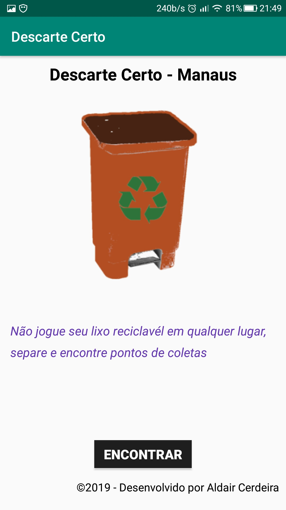

# Aplicativo Android com utilização da API Google Maps

	ALDAIR CERDEIRA
	contato: aldaircerdeira10@hotmail.com

- 	Curso:  Ciência da computação	
-   7ª período	2ª semestres de 2019
- 	Trabalho de atividades pratica supervisionadas – APS
-	Tema do Projeto: DESENVOLVIMENTO DE UMA APLICAÇÃO MOBILE VOLTADA À COLETA DE MATERIAIS RECICLÁVEIS

## Informações do app

- Linguagem de programação: Java 8

- IDE de desenvolvimento: Android Studio

- Utilização da API Google Maps

- Sistema: aplicativo para Android

- Versão do Android – o projeto foi desenvolvido para ser rodado a partir da versão 6  marshmallow 

## recursos da aplicação

- Vinculação com a google maps
- captura a localização do usuário em tempo real
- criação de marcadores no mapa
- customização dos marcadores

## Apresentação do aplicativo

